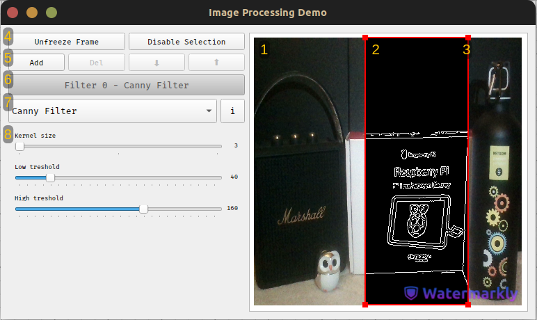

# iLID - Interactive Layered Image processing Demonstration

---
## Description

This application provides and environment for demonstrating and
tweaking various image filtering and distortion techniques. It does so through the use of a
filter library, that allows for indefinite extensions, and a graphical interface used to access
processing parameters, create filter combinations and visualize the end result in real time.

The source code can be found at the following address:
> https://gitlab.upt.ro/victor.toporan/ISP_Demo

and coned using:
```bash
git clone https://gitlab.upt.ro/victor.toporan/ISP_Demo
```

---
## Prerequisites
The following packages need to be install before proceeding to the application build:
* **C++ compiler** - `g++` was used for this project.
* **CMake v3.16+** - installed using the [official guide](https://cmake.org/install/)
* **OpenCV 4.2** - installed using the [official guide](https://docs.opencv.org/4.x/da/df6/tutorial_py_table_of_contents_setup.html)
* **Qt 5.15** - installed using the [official guide](https://doc.qt.io/qt-5/gettingstarted.html)

On systems supporting the `apt` package manager, dependencies can be installed by running the provided script as superuser
```bash
cd ISP_Demo
sudo ./dependencies.sh
```
or installed manually using the following commands:
```bash
sudo apt-get install g++
sudo apt-get install cmake
sudo apt-get install qt5-default
sudo apt-get install libopencv-dev
```

---
## Build
All the installation steps can be perfomed at once, using the provided script
```bash
./install.sh
```
or the build can be carried out manually, using the following commands:
```bash
cd src
cmake -H. -Bbuild
cd build
make all
```

It should be noted that this method does not create a desktop shortcut, meaning that
if one is required, it has to be created manually, having the following contents

> [Desktop Entry] \
> Name=iLID \
> Exec=$ISP_DEMO_ROOT/src/build/IspDemo.exe \
> Icon=$ISP_DEMO_ROOT/src/resources/ISP_Demo_Shutter.png \
> Type=Application \
> Terminal=false \
> Encoding=UTF-8

and has to be enabled to launch the application using
```bash
gio set $DESKTOP_SHORTCUT metadata::trusted true
chmod a+x $DESKTOP_SHORTCUT
```

Where the environment variables `ISP_DEMO_ROOT` and `DESKTOP_SHORTCUT` are set to the paths of the application root directory and the desktop shortcut respectively.

---
## Usage

Using eighter build method, two executables are compiled: 
* `IspDemo.exe` - used to run the application
* `Measurements.exe` - used to run filter benchmark, result is written to `ISP_DEMO_ROOT/src/resources.measurements.csv`

Both can be accessed from the command line using
```bash
cd $ISP_DEMO_ROOT/src/build
./Measurements.exe
./IspDemo.exe
```
The main application can also be launched from the desktop shortcut, if it was created during the build process.

Opening the application, the following user interface will be shown:
<p align="center" width="100%">
    
</p>
It can be separated into the following subsections:

1. **Viewport** - the resulting image, after all filters are applied, will be shown here.
2. **Region of interest** - any given filter will be applied only within its designated ROI.
3. **ROI anchors** - used to resize the region of interest.
4. **Miscellaneous** - used to pause the frame capture and disable the ROI selection.
5. **Filter management** - used to add, delete or change a filters application order.
6. **Filter layout** - used to chose the active ROI and preview filter application order.
7. **Filter selection** - used to change the currently applied filter, as well as provide information about parameters.
8. **Parameter management** - used to tweak filter parameters in order to change resulting image.

> NOTE: For more information reagrding system setup, please consult the user guide.
